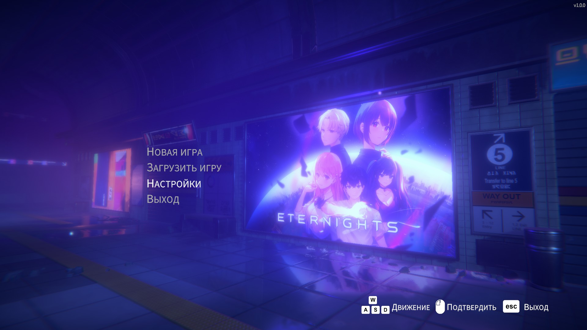
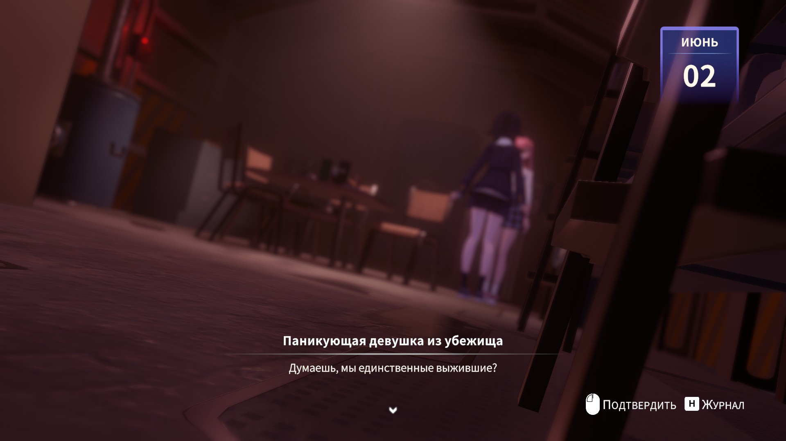

# Eternights — Русификатор

Русский перевод для игры [Eternights](https://store.steampowered.com/app/1402110/Eternights/).





## Установка

1. Скачай `Eternights_Russian.exe` из [Releases](../../releases)
2. Запусти, нажми **Установить**
3. В игре выбери язык **Deutsch** (он заменён на русский)

## Что переведено

- **Диалоги**: ~8000 строк — все сюжетные диалоги, выборы, реплики
- **UI/Меню**: 737 строк — настройки, инвентарь, навыки
- **Туториалы, достижения, локации, предметы, тест характера** — всё

## Как работает

Подменяем немецкий язык (de) на русский. Кириллица поддерживается встроенным шрифтом NotoSansKR.

Патчатся 3 файла:
- `resources.assets` — диалоги
- `gamemanager bundle` — UI (TextTable) + Dropdown + диалоги
- `catalog.json` — CRC обнуляется

## Удаление

Запусти `Eternights_Russian.exe` и нажми **Удалить** — оригинальные файлы восстановятся из бэкапа.

## Сборка из исходников

```bash
pip install UnityPy pyinstaller
python build_exe.py
```

## Лицензия

Fan translation. Not affiliated with Studio Sai.
